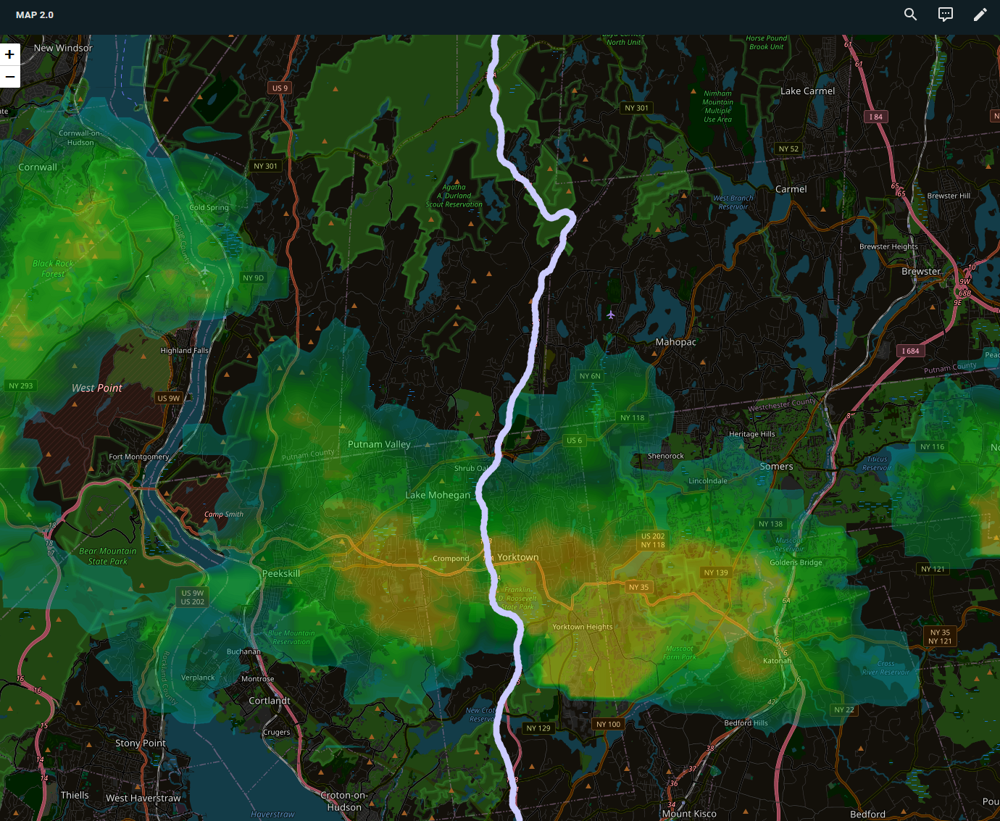

I just wanted to share my config after creating a rainviewer overlay, and correcting the dark mode display with card mod.

I'll lay out the code first, then mention some hurdles I had, and how I worked around them.

Firstly, in your configuration.yaml, you'll need rest sensors to get the current frame, and previous frames from rainviewer:


```yaml
rest:
  - resource: https://api.rainviewer.com/public/weather-maps.json
    scan_interval: 300  # Every 5 minutes
    sensor:
     - name: rainviewer_frame
       value_template: "{{ value_json.radar.nowcast[0].path }}"
     - name: rainviewer_frames
       value_template: "{{ value_json.radar.past[-10:] | map(attribute='path') | join(',') }}"
```


Adjust the value_json.radar.past[-10:] to suit your needs. I left it at -10 even though I only animate 5 frames (for resource purposes.)

Next, you'll need two helpers:

First, one that is the frame number index that will be changed via an automation:


```
input_number.rainviewer_frame_index
Minimum value: 0
Maximum value :4 <---- This will determine the number of frames shown. In this case, 5 frames (0 through 4). adjust for your needs.
Step size: 1
Display Mode: Slider
```


Second, you'll need a template sensor: `sensor.rainviewer_current_frame`:


```jinja

{# cap = total frames you want. Determined by the helper rainviewer_frame_index max value #}

{# take the last (cap-1) historical URLs #}

{# append the live frame from your other sensor #}

{# pick by index #}

{{ full[idx] }}
```


Now, We need to create an automation to cycle the frames on the map:


```yaml
alias: Cycle RainViewer Frames
description: >-
  Cycle through the most‑recent N RainViewer frames, pause on the newest, then
  loop
triggers:
  - seconds: /1 # This is how quickly the frames will change. Adjust to your needs.
    trigger: time_pattern
conditions: # Optional. I do this to let the server rest when not needed.
  - condition: time
    after: "06:00:00"
    before: "00:00:00"
actions:
  - target:
      entity_id: input_number.rainviewer_frame_index
    action: input_number.increment
    data: {}
  - choose:
      - conditions: # This checks to see if we have reached the last frame
          - condition: template
            value_template: >
              
              
              {{ idx >= (cap - 1) }}
        sequence:
          - delay: "00:00:05" # How long to pause on the last frame.
          - target:
              entity_id: input_number.rainviewer_frame_index
            data:
              value: 0
            action: input_number.set_value
          - data: # This is optional, but suggested to keep database bloat to a minimum. This clears the history of the sensors older than the keep_days below.
              keep_days: 0.05
              entity_id:
                - sensor.rainviewer_current_frame
                - input_number.rainviewer_frame_index
            action: recorder.purge_entities
mode: single

```


Lastly, the card itself. This is a stripped down anonymized version:


```yaml
type: custom:map-card
focus_follow: none
theme_mode: light # Dark mode applies css filters to all layers and makes the rainmap layer look wrong.
tile_layer_options:
  maxZoom: 21
entities:
  - entity: person.user
    use_base_entity_only: true
    history_start: 6 hours ago
    color: blue
  - entity: device_tracker.user_phone
    size: 20
    color: darkblue
  - entity: zone.home
    circle: auto
    display: icon
    icon: mdi:home
    size: 25
    color: lightblue
tile_layers:
  - url: >-
      https://tilecache.rainviewer.com{{
      states('sensor.rainviewer_current_frame') }}/512/{z}/{x}/{y}/7/1_0.png # the /7/ in the url adjusts the coloring of the map
    options:
      opacity: 0.4
card_mod: # This inverts ONLY the openstreetmap layer. 
  style: |
    ha-card img.leaflet-tile[src*="tile.openstreetmap.org"] {
      filter: invert(1) hue-rotate(180deg);
    }


```


Many of the things I found I had mentioned in the notes. 

I will say, not purging the old data made homeassistant angry anytime I tried to view any of the sensors I created. The high update rate puts some stress on the system.

Some of my lower end clients aren't super happy with the map with the animation as I am using it in a dashboard in panel view. This is why I had to keep the animation slowish and limit the frames. Your experience will vary based on hardware. The old google nest hub display I have constantly casting dashboard is an example of a device that struggles pretty hard. It will often reboot if I leave the map card dashboard open.

I'm running homeassistant OS as a VM on a healthily configured Dell R730XD running proxmox and I was still experiencing some lag on the map until I added the purge to the automation.

If you don't want or need animation, All you would need to overlay the latest radar images is the first rest sensor:


```yaml
rest:
  - resource: https://api.rainviewer.com/public/weather-maps.json
    scan_interval: 300  # Every 5 minutes
    sensor:
     - name: rainviewer_frame
       value_template: "{{ value_json.radar.nowcast[0].path }}"
```


Then adjust the card yaml and add this:


```yaml
tile_layers:
  - url: >-
      https://tilecache.rainviewer.com{{
      states('sensor.rainviewer_frame') }}/512/{z}/{x}/{y}/7/1_0.png
    options:
      opacity: 0.4
```


Here is how it looks:


I tried getting a traffic overlay on the map as well, but I gave up at the point where I realized I'd probably have to pay for an API to do so. If anyone has any suggestions, I'd love to hear them!


----------------------
- Updated 05/16/2025 -
Corrected the project to ensure the current frame is shown at the end of the animation, and adjusted frame count determination.
