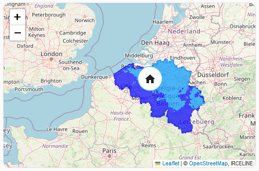

Basic WMS layer, using the [irceline.be](https://www.irceline.be) provided WMS map.

### Code

```yaml
type: custom:map-card
zoom: 8
card_size: 6
wms:
  - url: https://geo.irceline.be/rioifdm/wms
    options:
      layers: pm25_hmean
      transparent: true
      format: image/png
      opacity: 0.7
      tiled: true
      time: now
      attribution: '<a href="https://www.irceline.be/">IRCELINE</a>'
tile_layer_url: 'https://basemaps.cartocdn.com/rastertiles/voyager/{z}/{x}/{y}.png'
tile_layer_attribution: '&copy; <a href="https://www.openstreetmap.org/copyright">OpenStreetMap</a>, &copy; <a href="https://carto.com/attributions">CARTO</a>'
entities:
  - entity: zone.home
    display: icon
    size: 50
  - person.nathan   
```

